# OMR 답안지 채점 프로그램 사용법

`omr_grader.exe` 파일 하나만 있으면 됩니다. 아래 순서대로 그대로 따라 하시면 됩니다.

## 1. 실행하기

`omr_grader.exe`를 더블클릭하면 몇 초간 아래 로딩 화면이 뜹니다.

로딩이 끝나면 이런 창이 뜹니다. 이게 메인 화면입니다.

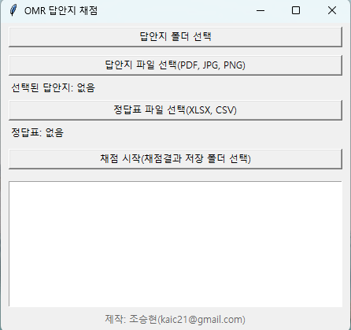

## 2. 정답표 엑셀 만들기

채점하려면 먼저 정답표를 엑셀 파일로 만들어야 합니다. **빈 엑셀 파일을 새로 열어서** 아래처럼 만드세요.

- A1 칸에 `문항번호`, B1 칸에 `정답`을 입력합니다.
- 2행부터 문항번호(1, 2, 3...)와 그 문항의 정답(1~5 중 하나)을 한 줄씩 채웁니다.
- 실제 시험이 몇 문항이든 상관없습니다. **문항 수는 이 엑셀의 행 개수로 자동으로 정해집니다** — 10문항 시험이면 10줄만 채우면 됩니다.
- 다 채웠으면 `.xlsx` 파일로 저장합니다 (예: `정답표.xlsx`).

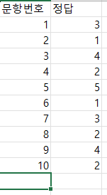

## 3. 답안지 파일 선택

메인 화면에서 **"답안지 파일 선택(PDF, JPG, PNG)"** 버튼을 누릅니다. (여러 장이 스캔된 PDF 하나를 골라도 되고, 사진 파일 여러 개를 한 번에 골라도 됩니다. 답안지가 폴더 하나에 다 들어있으면 위쪽의 "답안지 폴더 선택" 버튼을 써도 됩니다.)

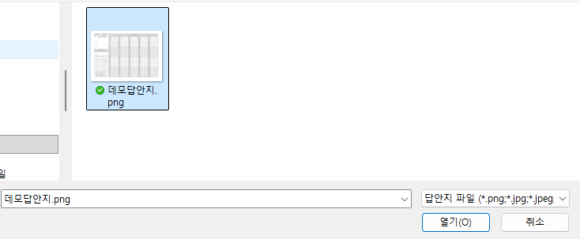

선택하면 화면에 "선택된 답안지: N개"라고 뜹니다.

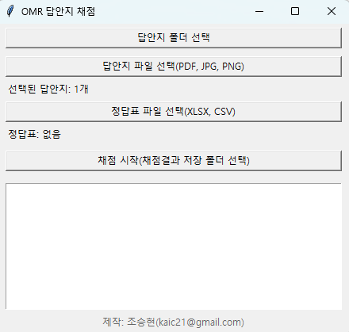

## 4. 정답표 파일 선택

**"정답표 파일 선택(XLSX, CSV)"** 버튼을 눌러서, 2번에서 만든 정답표 엑셀을 고릅니다.

> ⚠️ **정답표 엑셀 파일은 반드시 닫아둔 상태**여야 합니다. 엑셀에서 그 파일을 열어놓은 채로 진행하면 `[Errno 13] Permission denied` 오류가 뜨면서 실패합니다. 정답표를 다 만들었으면 저장 후 엑셀 창을 닫고 진행하세요.

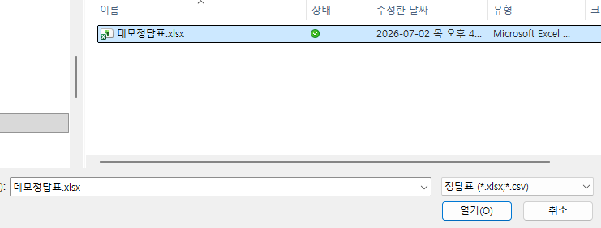

선택하면 화면에 정답표 파일 경로가 뜹니다.

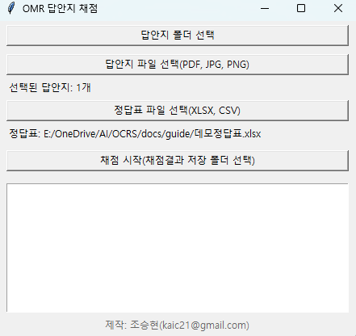

## 5. 채점 시작

**"채점 시작(채점결과 저장 폴더 선택)"** 버튼을 누르면, 결과를 저장할 폴더를 고르는 창이 뜹니다. 원하는 폴더를 고르거나, 새 폴더를 만들어서 선택하세요.

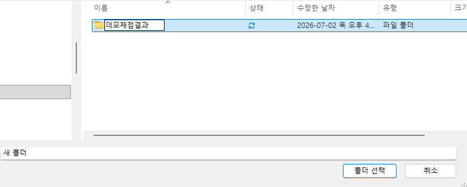
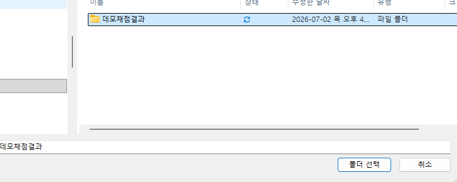

채점이 끝나면 이런 완료 팝업이 뜹니다.

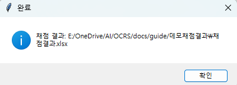

## 6. 결과 확인하기

방금 고른 저장 폴더를 열어보면 이렇게 두 가지가 생겨 있습니다.

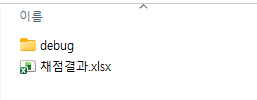

- **`채점결과.xlsx`**: 학번, 문항별 답안, 점수, 오답문항, 확인필요 열이 있는 엑셀 파일입니다.

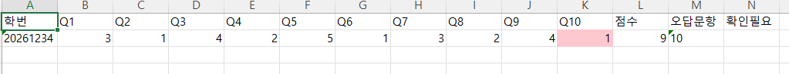

  위 예시에서는 10번 문항이 틀려서(빨간 셀) 점수가 9점이고, 오답문항 열에 "10"이 표시됩니다. 확인필요 열이 비어있으면 미응답/중복마킹 없이 전부 정상적으로 인식됐다는 뜻입니다.

- **`debug` 폴더**: 학생 답안지마다 이미지 파일이 하나씩 들어있습니다. 다음 항목에서 자세히 설명합니다.

## 7. (필요시) debug 폴더 활용법

`debug` 폴더 안의 이미지를 열어보면, 원본 답안지 위에 프로그램이 인식한 마킹 위치가 원으로 표시되어 있습니다.

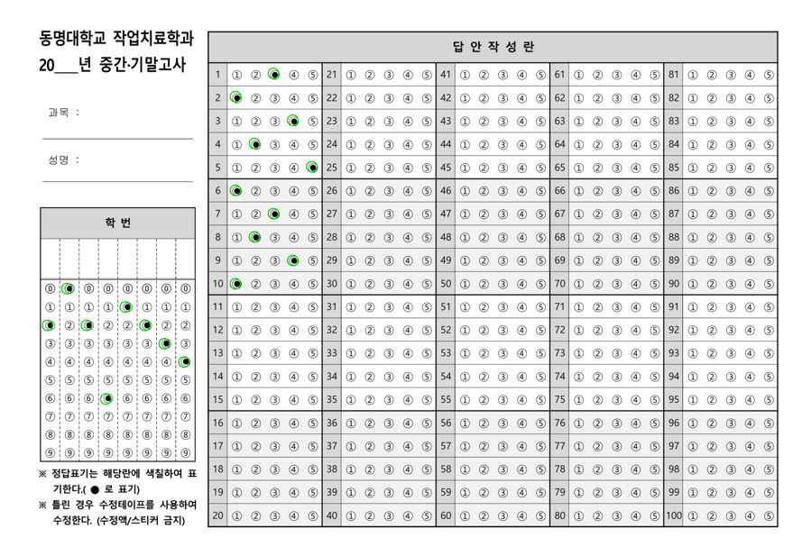

- **초록 원**: 정상적으로 인식된 마킹입니다. 별도로 확인할 필요 없습니다.
- **빨간 원**: 애매하게 인식되어 "확인이 필요"하다고 판단한 자리입니다 (학번 자리에서 나타날 수 있습니다).
- **원이 아예 없는 문항**: 미응답이거나 두 개 이상 마킹된(중복) 경우입니다. 해당 문항 번호는 `채점결과.xlsx`의 "오답문항"과 "확인필요" 열에도 나타납니다.

**언제 열어봐야 하나요?**

- 매번 다 열어볼 필요는 없습니다. `채점결과.xlsx`의 "확인필요" 열에 뭔가 적혀 있는 학생만 골라서, 그 학생의 debug 이미지를 열어보면 됩니다.
- 이미지 파일 이름은 `0000_원본파일이름.png`처럼 학생 순서 번호 + 원본 스캔 파일명으로 되어 있어서, 어느 학생 것인지 쉽게 찾을 수 있습니다.
- 원본 답안지와 비교해서, 실제로 학생이 마킹을 안 했으면 그대로 오답(0점) 처리하면 되고, 만약 학생이 마킹은 했는데 너무 연하게 칠해서 프로그램이 놓친 거라면 `채점결과.xlsx`에서 그 셀 값을 직접 고쳐서 점수를 수정하면 됩니다.
